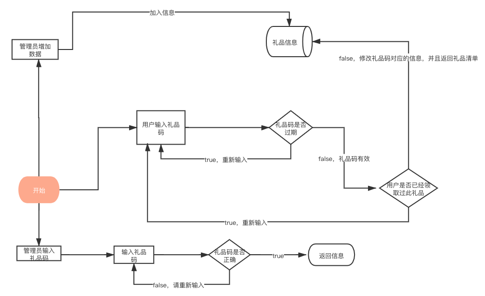

## 1.整体框架

整体功能的实现思路	

设计管理员，用户，message三个结构，message里储存填写礼品码，查询创建时间、创建人员、礼品描述、礼品内容列表（物品、数量）、可领取次数、有效期、已领取次数、领取列表（领取用户、领取时间）等信息。

需要四个方法：get，set，update，have，即增，查（返回所有数据），改，查（是否存在）

然后用gin框架部署，客户端通过http get访问

## 2.目录结构

```
.
├── README.md
├── __pycache__
│   └── locustfile.cpython-39.pyc
├── app
│   ├── app
│   ├── http
│   │   └── httpServer.go
│   ├── main.go
│   └── model
│       └── database.go
├── day3压力测试报告.html
├── day3流程图.png
├── go.mod
├── go.sum
├── internal
│   ├── ctrl
│   │   └── api.go
│   ├── gError.go
│   ├── handler
│   │   ├── operation.go
│   │   └── operation_test.go
│   └── router
│       └── router.go
└── locustfile.py


```

## 3.逻辑代码分层

|    层     | 文件夹                         | 主要职责                | 调用关系                  | 其它说明     |
| :-------: | ------------------------------ | ----------------------- | ------------------------- | ------------ |
|  应用层   | /app/http/httpServer.go        | 服务器启动              | 调用路由层                | 不可同层调用 |
|  路由层   | /internal/router/router.go     | 路由转发                | 被应用层调用，调用控制层  | 不可同层调用 |
|  控制层   | /internal/ctrl/api.go          | 请求参数处理，响应      | 被路由层调用，调用handler | 不可同层调用 |
| handler层 | /internal/handler/operation.go | 处理具体业务            | 被控制层调用              | 不可同层调用 |
|  model层  | /app/model/database.go         | redis储存需要的数据结构 | 被handler调用             | 不可同层调用 |
| 压力测试  | locustfile.py                  | 进行压力测试            | 无调用关系                | 不可同层调用 |
|  gError   | /internal/gError               | 统一异常处理            | 被handler调用             | 不可同层调用 |

## 4.存储设计

通过string的方式存入redis，key为礼品码，value为礼品信息，礼品信息是一个结构体，取数据时，先将json串转为结构体然后在进行操作

## 5.接口设计

请求方法：

http post

| 接口地址                 | 请求参数                                                | 描述           |
| ------------------------ | ------------------------------------------------------- | -------------- |
| localhost:8000/SetStr    | Description，Creator，AvailableTimes，List，ValidPeriod | 管理员录入数据 |
| localhost:8000/GetStr    | key                                                     | 管理员查询数据 |
| localhost:8000/UpdateStr | key，username                                           | 用户领取礼品   |

localhost:8000/SetStr   参数例子 

| Key            | Value               | 描述       |
| -------------- | ------------------- | ---------- |
| Description    | 张三录入礼品信息    | 描述信息   |
| Creator        | 张三                | 创建者     |
| AvailableTimes | 10                  | 可领取次数 |
| List           | 士兵,4,炮车,8       | 礼品清单   |
| ValidPeriod    | 2021-01-02 00:00:00 | 有效期     |

响应状态码

| 状态码 | 描述         |
| ------ | ------------ |
| 1001   | 礼品码不存在 |
| 1002   | 礼品码过期   |
| 1003   | 不可重复领取 |
| 1004   | 礼品全部领完 |

## 6.第三方库

```
  _ "errors"
	_ "reflect"
	"github.com/gin-gonic/gin"
	"net/http"
	"strings"
	"time"
	"io"
	"testing"
	"encoding/json"
	"strconv"
```

## 7.编译运行

cd app

go build

./app

运行

cd internal

cd handler

go test

单元测试

locust

压力测试

